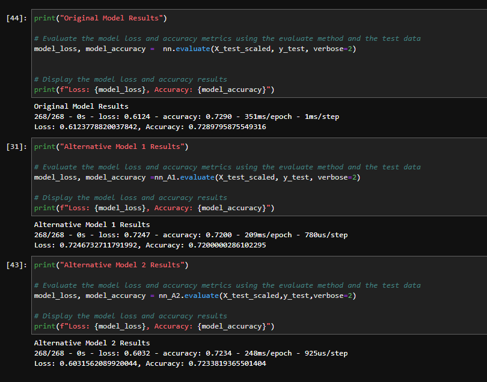

# Deep-neural-networks
Challenge 13 for Fintech bootcamp through UC Berkeley. Using deep neural networks to analyze a dataset containing VC investments in companies that then either failed or became successful. The goal is to create a model that can determine whether a startup will eventually be successful or not. 

The notebook in this repo `venture_funding_with_deep_learning.ipynb` starts by reading in the csv file from the `Resources` folder that contains the learning data from over 34,000 companies and lots of data on those companies. Then we clean the data so we can create some deep learning models. The specific models are coming from the tensorflow libraries and specifically using the `Sequential()` model instance. I tried creating 3 different models trained on the same data with various hidden layers and number of neurons in each layer to see the difference between their accuracy on the test data and compare the results. The results can be found further below in the readme result section or inside the notebook if you want to mess with the code yourself. If you need help setting up a `dev` environment or similar, follow below or skip if you already have one setup. 

---
## Packages and Version

First before installing any packages and getting setup make sure you are in a `dev` environment or an environment(env) you are comfortable downloading packages into. 
To get your `dev` environment setup do the following in your command line:

- Creating a dev environment for python 3.7 called 'dev' - if you do not already have an environment setup 
    - Get setup in your preferred CLI (Gitbash, terminal, etc)
    - `conda create -n dev python=3.7 anaconda`
    - Once you have created the environment, type the following to activate and deactivate.

Once you are setup with your `dev` or similar env the only package you need is for the machine learning models, alot of packages are included in tensorflow and scikit-learn.

- tensorflow == 2.11 or higher
    `pip install --upgrade tensorflow` - if you don't have it
- scikit-learn == 1.0.2 or higher

Once you have tensorflow verify you also have Keras 

`python -c "import tensorflow as tf;print(tf.keras.__version__)"` == 2.11 or higher

Then you are good to open up jupyter lab and run the code. 

---
## Usage and Results

Once you are in your `dev` or similar env, if you wish to view the notebook in jupyter lab, simply navigate to the directory that contains the notebook inside your preferred command line interface and type `jupyter lab`. If you wish to view it in a browser and not see the code type in `venture_funding_with_deep_learning.ipynb`. 

Once the data was ready i created three different models to compare the results with different number of neurons, and hidden layers. All the models trained and tested on the same data, which had 116 different inputs and 1 output(successful or not). The first model had two hidden layers, the first layer with 58 neurons and the second with 29 neurons and 8527 total parameters. The second model also had two layers, but with less neurons 8 in the first layer, and 4 in the second with a total of 977 parameters. The third model went for 3 hidden layers, with 58 neurons in the first, then 20 in the second and 2 neurons in the third layer, for a total of 8011 parameters. 

The results on the testing data can be seen in the image below:

We can see from these results that while all the models performed very similarly the first model was the on that had the highest accuracy  but not the lowest loss compared to the other two. The lowest loss went to the third model with 3 hidden layers. The first model had mathematical decided neurons by taking the inputs/2 and then for the second layer divide the neurons again by two. 

All models had the same activation functions for both the hidden layers and the output neuron. so the only difference was the number of neurons and layers which could also be cause for the very similar results on the testing data. 

What these results mean is that any new company data that have the same number of inputs as the training data, when fed to the model the prediction it gives has a 72% chance of actually being correct. I would not entirely trust this model and would definitely have to look deeper on the '1's it gives out but it will narrow down a larger list to a more managable size. Further research and training would be needed to make the model preform better with more accuracy.

---
## Contributors

[Robin Thorsen] (https://www.linkedin.com/in/robin-thorsen-079819120/) was the main developer/analyst working on this project. Starter code and resources provided by UC Berkeley.

Best reached via email - robinbthorsen@gmail.com

---

## License

Apache 2.0 public License applied, feel free to clone and fork and use and reach out if you have questions. 

